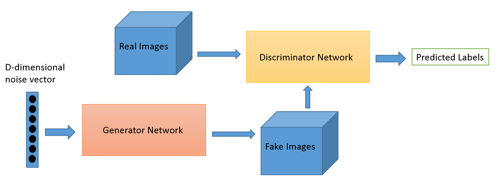

# generating-mnist-digits-with-GAN

> _by Victor I. Afolabi_

## Table of content

* [Generative Adversarial Network (or GAN) Architecture](#generative-adversarial-network-or-gan-architecture)

* [Discriminator Network](#discriminator-network)

* [Generator Network](#generator-network)

* [Further Reading](#furter-reading)

* [Contributions](#contributions)

## Generative Adversarial Network (or GAN) Architecture

**Generative adversarial networks** consist of two models: *a generative model* and *a discriminative model.*

*The discriminator model* is a classifier that determines whether a given image looks like a real image from the dataset or like an artificially created image. This is basically a binary classifier that will take the form of a normal convolutional neural network (CNN).

*The generator model* takes random input values and transforms them into images through a deconvolutional neural network.

Over the course of many training iterations, the weights and biases in the discriminator and the generator are trained through backpropagation. The discriminator learns to tell "real" images of handwritten digits apart from "fake" images created by the generator. At the same time, the generator uses feedback from the discriminator to learn how to produce convincing images that the discriminator can't distinguish from real images.

## Discriminator Network

Our discriminator is a convolutional neural network that takes in an image of size `28 x 28 x 1` as input and returns a single scalar number that describes whether or not the input image is "real" or "fake"—that is, whether it's drawn from the set of MNIST images or generated by the generator.

## Generator Network

Now that we have our discriminator defined, let’s take a look at the generator model. We'll base the overall structure of our model on a simple generator published by [Tim O'Shea.](https://github.com/osh/KerasGAN)

You can think of the generator as a kind of reverse convolutional neural network. A typical CNN like our discriminator network transforms a 2- or 3-dimensional matrix of pixel values into a single probability. A generator, however, takes a d-dimensional vector of noise and upsamples it to become a `28 x 28` image. ReLU and batch normalization are used to stabilize the outputs of each layer.

## Further Reading

* [Generative Adversarial Networks for Beginners](https://www.oreilly.com/learning/generative-adversarial-networks-for-beginners)

* Siraj YouTube

* [Deep learning research review](https://adeshpande3.github.io/adeshpande3.github.io/Deep-Learning-Research-Review-Week-1-Generative-Adversarial-Nets)

* [Generative Adversarial Networks (GANs) in 50 lines of code (PyTorch)](https://medium.com/@devnag/generative-adversarial-networks-gans-in-50-lines-of-code-pytorch-e81b79659e3f)

* [An introduction to Generative Adversarial Networks (with code in TensorFlow)](http://blog.aylien.com/introduction-generative-adversarial-networks-code-tensorflow/)

## Contributions

Please don't hesitate to [shoot me a mail.](mailto:javafolabi@gmail.com) should any issue arise while running the code, or you have questions, or you just wanna say "hi". I'd really appreciate that :)
